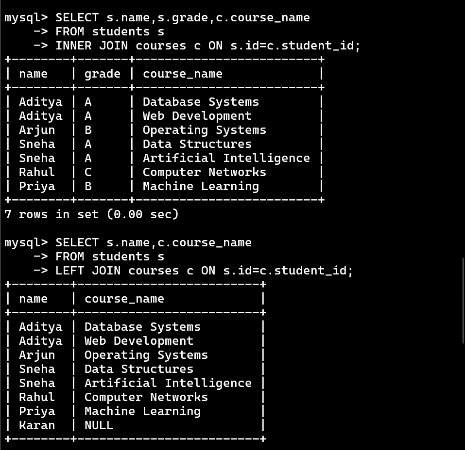
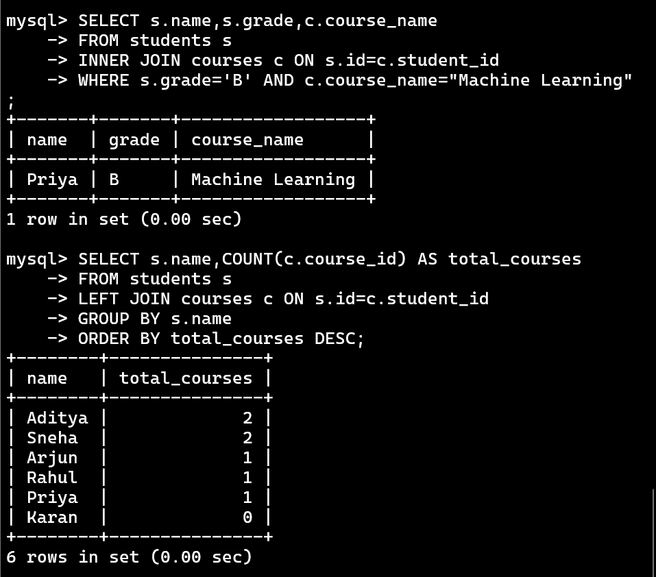

# SQL Developer Internship 

## Task 3: Writing Basic `SELECT` Queries

## 📌 Objective
Practice SQL queries (`SELECT`, `WHERE`, `ORDER BY`, `LIMIT`) and demonstrate joins using **multiple tables**.

## 📂 Files
- `queries.sql` → SQL script with:
  - Table creation (`students`, `courses`)
  - Sample data insertion
  - Queries with filtering, sorting, limiting
  - Joins (INNER JOIN, LEFT JOIN)

## 📊 Sample Tables

### Students
| id | name   | age | email              | grade |
|----|--------|-----|--------------------|-------|
| 1  | Aditya | 21  | aditya@gmail.com   | A     |
| 2  | Arjun  | 19  | arjun@yahoo.com    | B     |
| 3  | Sneha  | 22  | sneha@gmail.com    | A     |
| 4  | Rahul  | 20  | rahul@hotmail.com  | C     |
| 5  | Priya  | 23  | priya@gmail.com    | B     |
| 6  | Karan  | 18  | karan@outlook.com  | A     |

### Courses
| course_id | course_name            | student_id |
|-----------|------------------------|------------|
| 101       | Database Systems       | 1          |
| 102       | Operating Systems      | 2          |
| 103       | Data Structures        | 3          |
| 104       | Computer Networks      | 4          |
| 105       | Machine Learning       | 5          |
| 106       | Web Development        | 1          |
| 107       | Artificial Intelligence| 3          |

## 📖 Queries Demonstrated
- `SELECT *`, projection (specific columns)  
- `WHERE`, `AND`, `OR`, `BETWEEN`  
- `LIKE` for pattern matching  
- `ORDER BY` (ASC/DESC)  
- `LIMIT` for top-N queries  
- `DISTINCT` for unique values  
- `AS` for aliasing  
- **INNER JOIN** → Students with their courses  
- **LEFT JOIN** → All students, even without a course  
- **GROUP BY** + `COUNT()` → Number of courses per student  

---

## 📖 Queries & Outputs

### 1️⃣ Select all students

```sql
SELECT * FROM students;
```
#### Output:
| id | name   | age | email             | grade |
|----|--------|-----|-------------------|-------|
| 1  | Aditya | 21  | aditya@gmail.com  | A     |
| 2  | Arjun  | 19  | arjun@yahoo.com   | B     |
| 3  | Sneha  | 22  | sneha@gmail.com   | A     |
| 4  | Rahul  | 20  | rahul@hotmail.com | C     |
| 5  | Priya  | 23  | priya@gmail.com   | B     |
| 6  | Karan  | 18  | karan@outlook.com | A     |

#### Effect:
This query retrieves all columns and rows from the "students" table, showing the complete dataset without any filtering or sorting.

### 2️⃣ Students older than 20
```sql
SELECT * FROM students WHERE age > 20;
```
#### Output:
| id | name   | age | email             | grade |
|----|--------|-----|-------------------|-------|
| 1  | Aditya | 21  | aditya@gmail.com  | A     |
| 3  | Sneha  | 22  | sneha@gmail.com   | A     |
| 5  | Priya  | 23  | priya@gmail.com   | B     |

#### Effect:
This query filters the "students" table to show only those students whose age is greater than 20, helping to focus on a specific age group.


### 3️⃣ Top 3 oldest students
```sql
SELECT * FROM students ORDER BY age DESC LIMIT 3;
```
#### Output:
| id | name   | age | email             | grade |
|----|--------|-----|-------------------|-------|
| 5  | Priya  | 23  | priya@gmail.com   | B     |
| 3  | Sneha  | 22  | sneha@gmail.com   | A     |
| 1  | Aditya | 21  | aditya@gmail.com  | A     |

#### Effect:
This query sorts all students by age in descending order and limits the result to the top 3 oldest students, useful for identifying senior students.


### 4️⃣ Distinct grades
```sql
SELECT DISTINCT grade FROM students;
```
#### Output:
| grade |
|-------|
| A     |
| B     |
| C     |

#### Effect:
This query retrieves unique grades from the "students" table, eliminating duplicates, which is useful to see all possible grades present in the dataset.

### 5️⃣ INNER JOIN: Students with their courses
```sql
SELECT s.name, s.grade, c.course_name
FROM students s
INNER JOIN courses c ON s.id = c.student_id;
```
#### Output:
| name   | grade | course_name             |
|--------|-------|-------------------------|
| Aditya | A     | Database Systems        |
| Aditya | A     | Web Development         |
| Arjun  | B     | Operating Systems       |
| Sneha  | A     | Data Structures         |
| Sneha  | A     | Artificial Intelligence |
| Rahul  | C     | Computer Networks       |
| Priya  | B     | Machine Learning        |

#### Effect:
This INNER JOIN combines data from "students" and "courses" tables, showing only students who have at least one course assigned along with their grades and course names.


### 6️⃣ LEFT JOIN: All students (even without courses)
```sql
SELECT s.name, c.course_name
FROM students s
LEFT JOIN courses c ON s.id = c.student_id;
```
#### Output:
| name   | course_name             |
|--------|-------------------------|
| Aditya | Database Systems        |
| Aditya | Web Development         |
| Arjun  | Operating Systems       |
| Sneha  | Data Structures         |
| Sneha  | Artificial Intelligence |
| Rahul  | Computer Networks       |
| Priya  | Machine Learning        |
| Karan  | NULL                    |

#### Effect:
This LEFT JOIN shows all students, including those without any assigned courses. NULL indicates students who are not enrolled in any course.

### 7️⃣ Students with grade A in "Machine Learning"
```sql
SELECT s.name, s.grade, c.course_name
FROM students s
INNER JOIN courses c ON s.id = c.student_id
WHERE s.grade = 'A' AND c.course_name = 'Machine Learning';
```
#### Output:
(No rows returned — because "Machine Learning" belongs to Priya (B grade), not an A grade student.)

#### Effect:
This query filters for students with grade A who are enrolled in "Machine Learning". Since no student meets both conditions, the result is empty.

### 8️⃣ Count courses per student
```sql
SELECT s.name, COUNT(c.course_id) AS total_courses
FROM students s
LEFT JOIN courses c ON s.id = c.student_id
GROUP BY s.name
ORDER BY total_courses DESC;
```
#### Output:
| name   | total_courses |
|--------|---------------|
| Aditya | 2             |
| Sneha  | 2             |
| Arjun  | 1             |
| Rahul  | 1             |
| Priya  | 1             |
| Karan  | 0             |

#### Effect:
This query counts the number of courses each student is enrolled in. Students with no courses are shown with 0, and results are sorted by the total number of courses in descending order.


### Execution





