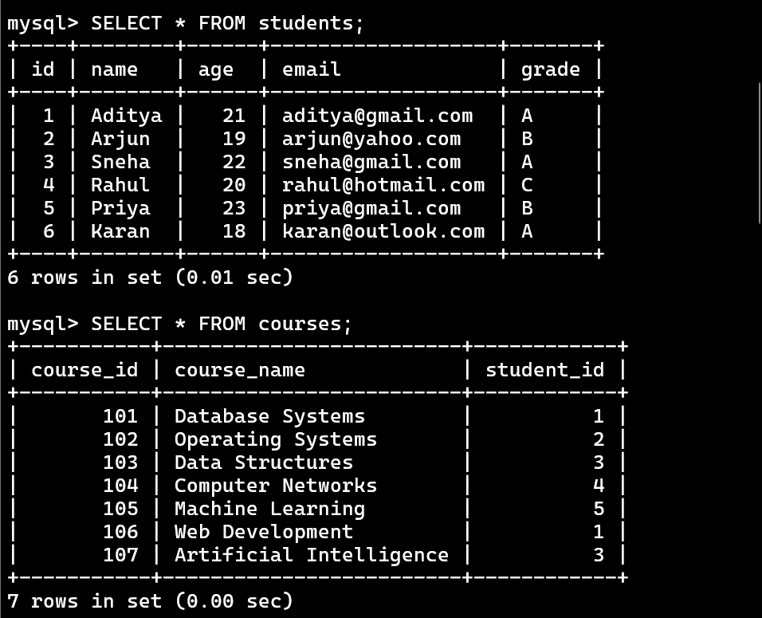
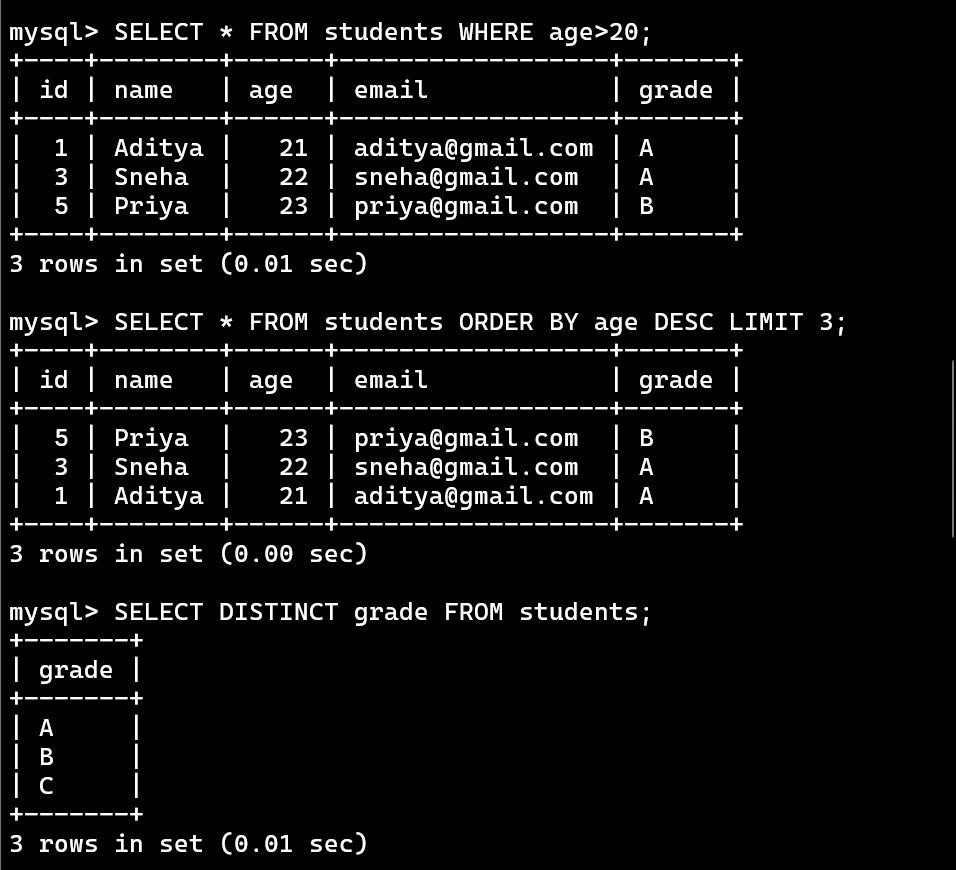
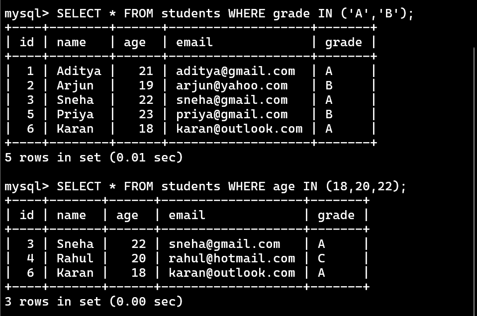
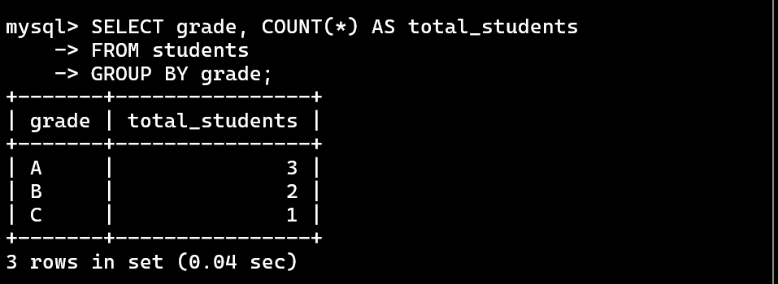

# SQL Developer Internship 

## Task 3: Writing Basic `SELECT` Queries

## 📌 Objective
Practice SQL queries (`SELECT`, `WHERE`, `ORDER BY`, `LIMIT`) and demonstrate joins using **multiple tables**.

## 📂 Files
- `queries.sql` → SQL script with:
  - Table creation (`students`, `courses`)
  - Sample data insertion
  - Queries with filtering, sorting, limiting


## 📊 Sample Tables

### Students
| id | name   | age | email              | grade |
|----|--------|-----|--------------------|-------|
| 1  | Aditya | 21  | aditya@gmail.com   | A     |
| 2  | Arjun  | 19  | arjun@yahoo.com    | B     |
| 3  | Sneha  | 22  | sneha@gmail.com    | A     |
| 4  | Rahul  | 20  | rahul@hotmail.com  | C     |
| 5  | Priya  | 23  | priya@gmail.com    | B     |
| 6  | Karan  | 18  | karan@outlook.com  | A     |

### Courses
| course_id | course_name            | student_id |
|-----------|------------------------|------------|
| 101       | Database Systems       | 1          |
| 102       | Operating Systems      | 2          |
| 103       | Data Structures        | 3          |
| 104       | Computer Networks      | 4          |
| 105       | Machine Learning       | 5          |
| 106       | Web Development        | 1          |
| 107       | Artificial Intelligence| 3          |

## 📖 Queries Demonstrated

- `SELECT *` → Projection (specific columns)
- `WHERE`, `AND`, `OR`, `BETWEEN` → Filtering rows
- `LIKE` → Pattern matching
- `ORDER BY (ASC/DESC)` → Sorting
- `LIMIT` → Top-N queries
- `DISTINCT` → Unique values
- `AS` → Aliasing columns
- `GROUP BY + COUNT()` → Aggregations and counts


---

## 📖 Queries & Outputs

### 1️⃣ Select all students

```sql
SELECT * FROM students;
```
#### Output:
| id | name   | age | email             | grade |
|----|--------|-----|-------------------|-------|
| 1  | Aditya | 21  | aditya@gmail.com  | A     |
| 2  | Arjun  | 19  | arjun@yahoo.com   | B     |
| 3  | Sneha  | 22  | sneha@gmail.com   | A     |
| 4  | Rahul  | 20  | rahul@hotmail.com | C     |
| 5  | Priya  | 23  | priya@gmail.com   | B     |
| 6  | Karan  | 18  | karan@outlook.com | A     |

#### Effect:
This query retrieves all columns and rows from the "students" table, showing the complete dataset without any filtering or sorting.

### 2️⃣ Students older than 20
```sql
SELECT * FROM students WHERE age > 20;
```
#### Output:
| id | name   | age | email             | grade |
|----|--------|-----|-------------------|-------|
| 1  | Aditya | 21  | aditya@gmail.com  | A     |
| 3  | Sneha  | 22  | sneha@gmail.com   | A     |
| 5  | Priya  | 23  | priya@gmail.com   | B     |

#### Effect:
This query filters the "students" table to show only those students whose age is greater than 20, helping to focus on a specific age group.


### 3️⃣ Top 3 oldest students
```sql
SELECT * FROM students ORDER BY age DESC LIMIT 3;
```
#### Output:
| id | name   | age | email             | grade |
|----|--------|-----|-------------------|-------|
| 5  | Priya  | 23  | priya@gmail.com   | B     |
| 3  | Sneha  | 22  | sneha@gmail.com   | A     |
| 1  | Aditya | 21  | aditya@gmail.com  | A     |

#### Effect:
This query sorts all students by age in descending order and limits the result to the top 3 oldest students, useful for identifying senior students.


### 4️⃣ Distinct grades
```sql
SELECT DISTINCT grade FROM students;
```
#### Output:
| grade |
|-------|
| A     |
| B     |
| C     |

#### Effect:
This query retrieves unique grades from the "students" table, eliminating duplicates, which is useful to see all possible grades present in the dataset.


### 5️⃣ Students with grade A or age 18
```sql
SELECT * FROM students WHERE grade='A' OR age=18;
```
#### Output:
| id | name   | age | email              | grade |
|----|--------|-----|------------------|-------|
| 1  | Aditya | 21  | aditya@gmail.com  | A     |
| 3  | Sneha  | 22  | sneha@gmail.com   | A     |
| 6  | Karan  | 18  | karan@outlook.com | A     |

#### Effect:
This query retrieves all students who either have grade A or are 18 years old, showing all matching rows from the students table.


### 6️⃣Students whose name starts with "A"


```sql
SELECT * FROM students WHERE name LIKE "A%";
```
#### Output:
| id | name   | age | email             | grade |
|----|--------|-----|-----------------|-------|
| 1  | Aditya | 21  | aditya@gmail.com | A     |
| 2  | Arjun  | 19  | arjun@yahoo.com  | B     |

#### Effect:
This query retrieves all students whose names start with the letter "A", using the LIKE operator for pattern matching.
### 7️⃣ Students with age between 19 and 22


```sql
SELECT * FROM students WHERE age BETWEEN 19 AND 22;

```
#### Output:
| id | name   | age | email              | grade |
|----|--------|-----|------------------|-------|
| 1  | Aditya | 21  | aditya@gmail.com | A     |
| 2  | Arjun  | 19  | arjun@yahoo.com  | B     |
| 3  | Sneha  | 22  | sneha@gmail.com  | A     |
| 4  | Rahul  | 20  | rahul@hotmail.com| C     |


#### Effect:
This query retrieves all students whose age is between 19 and 22 inclusive, using the BETWEEN operator to specify the range.
### 8️⃣Students with grade A or B

```sql
SELECT * FROM students WHERE grade IN ('A','B');
```
#### Output:

| id | name   | age | email              | grade |
|----|--------|-----|------------------|-------|
| 1  | Aditya | 21  | aditya@gmail.com | A     |
| 2  | Arjun  | 19  | arjun@yahoo.com  | B     |
| 3  | Sneha  | 22  | sneha@gmail.com  | A     |
| 5  | Priya  | 23  | priya@gmail.com  | B     |
| 6  | Karan  | 18  | karan@outlook.com| A     |


#### Effect:
This query retrieves all students whose grade is either A or B, using the IN operator to specify multiple possible values.
### 9️⃣ Students with age 18, 20, or 22

```sql
SELECT * FROM students WHERE age IN (18,20,22);
```

#### Output:
| id | name   | age | email              | grade |
|----|--------|-----|------------------|-------|
| 3  | Sneha  | 22  | sneha@gmail.com   | A     |
| 4  | Rahul  | 20  | rahul@hotmail.com | C     |
| 6  | Karan  | 18  | karan@outlook.com | A     |


#### Effect:
This query retrieves all students whose age is exactly 18, 20, or 22, using the IN operator to match multiple specific values.


### 🔟 Students with age 18, 20, or 22

```sql
SELECT grade, COUNT(*) AS total_students
FROM students
GROUP BY grade;
```

#### Output:
| grade | total_students |
|-------|----------------|
| A     | 3              |
| B     | 2              |
| C     | 1              |


#### Effect:
This query groups students by their grade and counts how many students are in each grade.
GROUP BY is used to aggregate data based on a specific column.
### Execution







